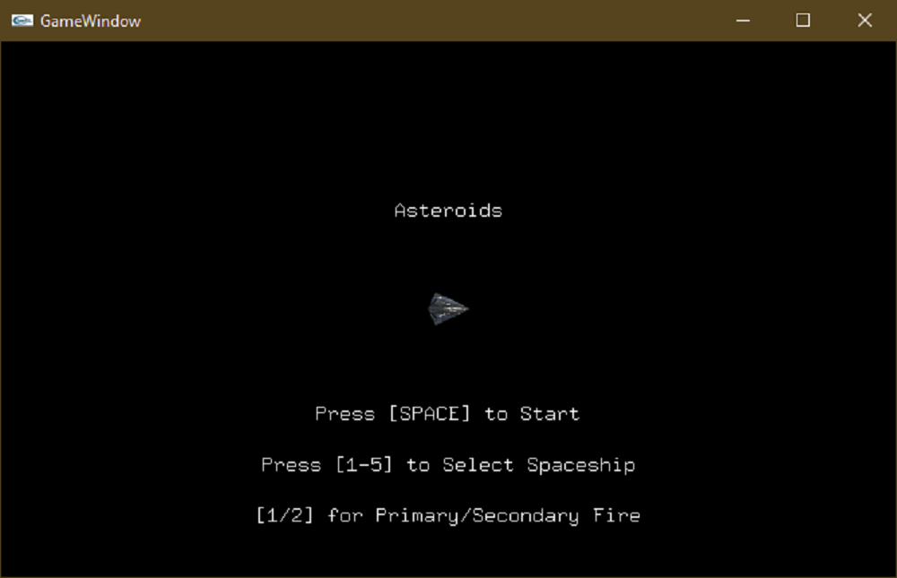
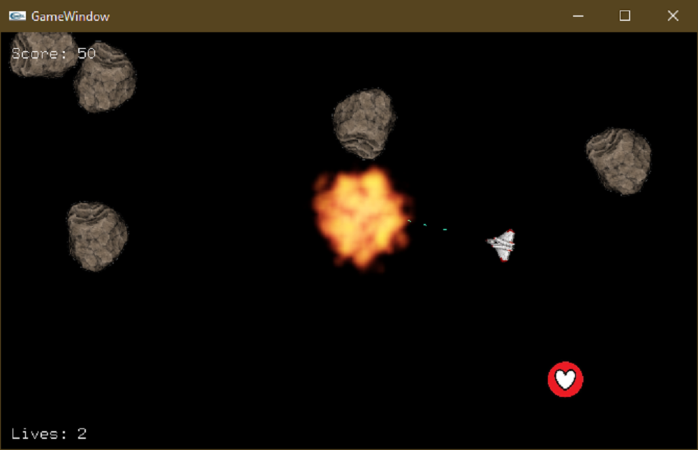
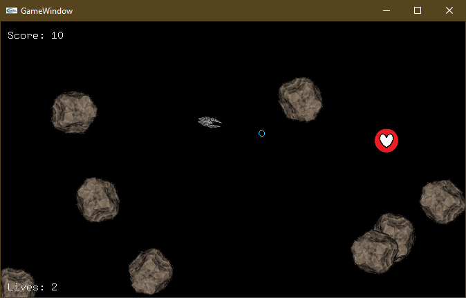
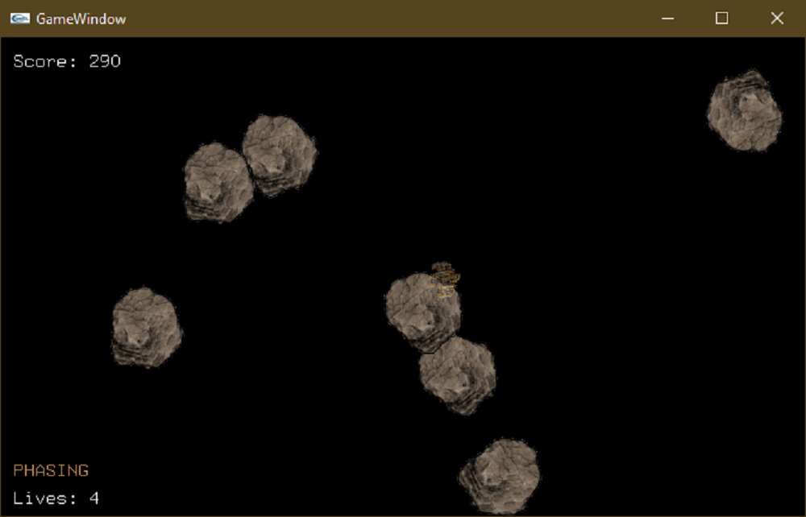
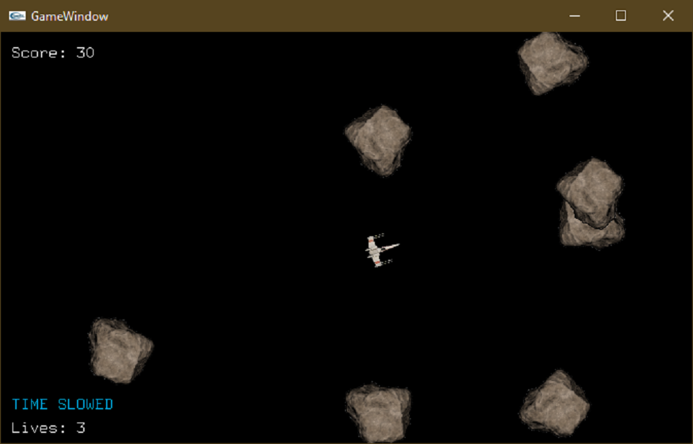

# Asteroids Game Project

This repository contains the code for an enhanced version of the classic Asteroids game, developed as part of my coursework. The game has been implemented using C++ and leverages OpenGL for rendering graphics on the screen.

## Coursework Details
- **Course**: IN2026 Games Technology
- **Institution**: City, University of London
- **Term**: Spring 2024

### Features
- **Start Screen:** Welcomes players with the game title, a start instruction, and a spaceship selection feature for a personalized gameplay experience.
- **Enhanced Shooting Mechanics:** Includes primary fire for destroying asteroids and a creative secondary fire system that allows for collecting power-ups through energy fields without direct collision.
- **Customizable Spaceships:** Players can choose their spaceship at the start of the game, adding a layer of customization that enhances engagement.

## What I Learned
- **Game Design Principles:** The project deepened my understanding of game flow, user interaction, and the importance of engaging game mechanics.
- **Advanced C++ Programming:** I enhanced my C++ skills, particularly in the areas of object-oriented programming, managing memory with smart pointers, and utilising complex data structures.
- **Graphics Programming:** Gained practical experience with OpenGL to render game graphics, handle transformations, and manage textures and sprites effectively.
- **Collision Detection:** Implemented sophisticated collision detection mechanisms tailored for both destructible objects (asteroids) and collectibles (power-ups).
- **Problem Solving:** Learned to address and overcome numerous challenges, such as managing game state transitions and integrating various game elements seamlessly.

## Screenshots
### Title Screen

*The title screen welcomes players with the game title and start instructions, featuring a spaceship selection for customization.*

### Asteroid Destruction

*Showcasing the primary fire in action, destroying asteroids as they appear on the screen.*

### Power-Up Bullet Shooting

*Demonstrating the secondary fire mechanism, where energy bullets collect power-ups without direct collision.*

### Phasing Power-Up Active

*The spaceship in phasing mode, allowing it to pass through obstacles without taking damage.*

### Time Slowed

*The game in slow motion, illustrating the effects of the time-slowing power-up.*

## Getting Started
To run this game, you will need a system with OpenGL installed and a C++ IDE or compiler setup. Follow these steps to compile and run the game:

1. Clone the repository to your local machine.
2. Open the project in your preferred C++ IDE (e.g., Visual Studio, Code::Blocks).
3. Build the project to resolve dependencies and compile the source code.
4. Run the executable to start the game.
